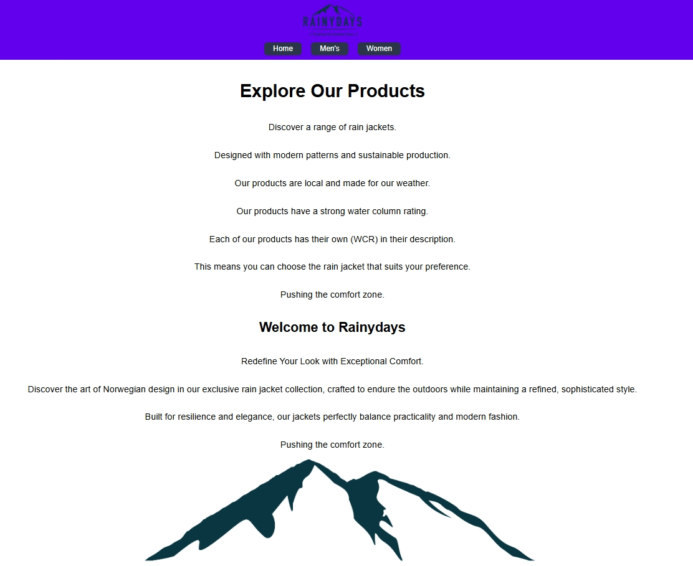
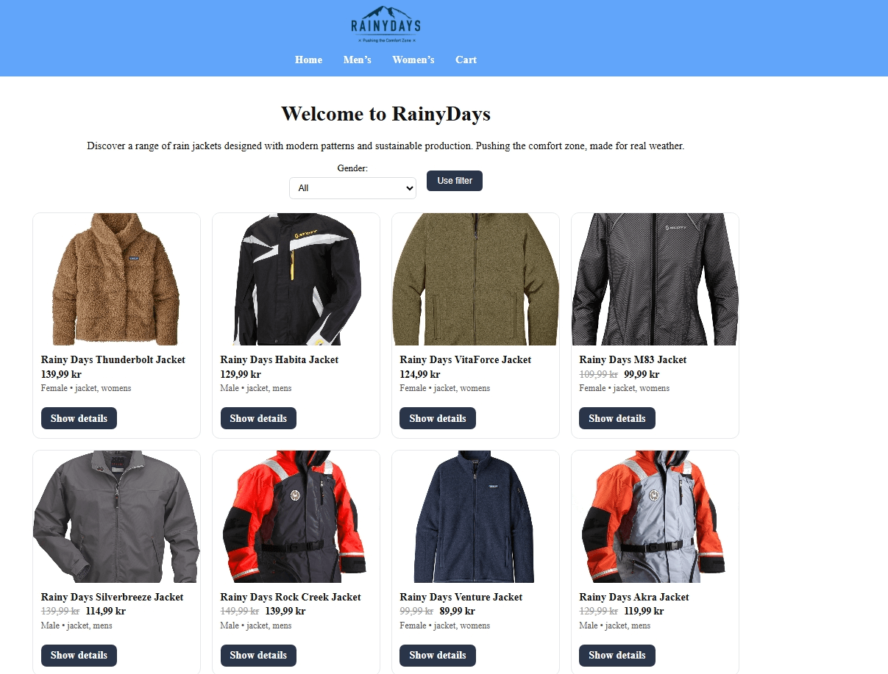
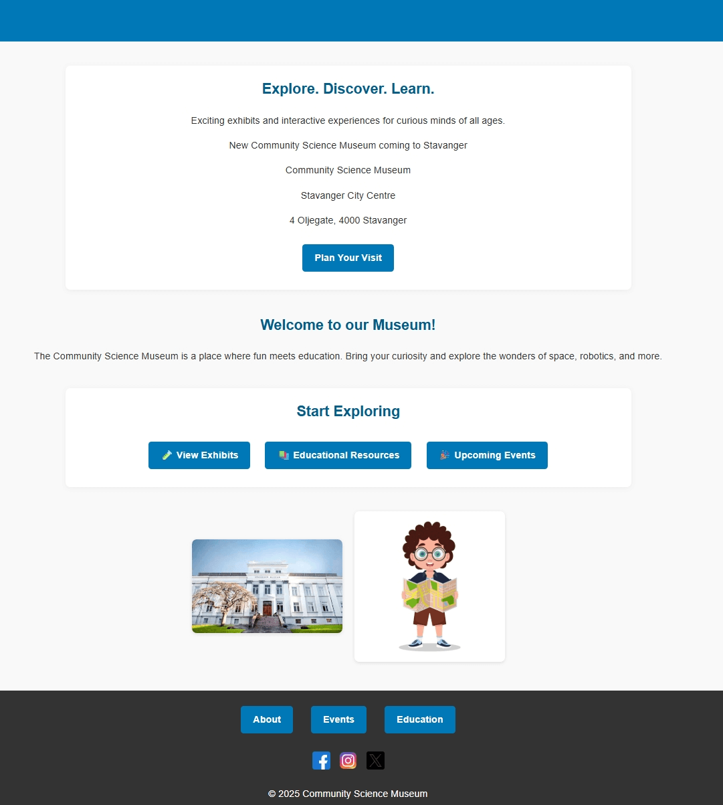

# Portfolio

This is my portfolio showcasing projects from my first year of the Front-End Development program.

## About

I am a first-year Front-End Development student with an interest in building clean and user-friendly websites using HTML, CSS, and JavaScript.

---

## Projects

### RainyDays (HTML & CSS)

**Description:**  
Responsive e-commerce website built with HTML and CSS.

**Preview:**  


**Repository:**  
https://github.com/Bjelland14/HTML-og-CSS-CA

**Live site:**  
https://bjelland14.github.io/HTML-og-CSS-CA/

---

### RainyDays JavaScript

**Description:**  
RainyDays project with focus on JavaScript functionality.

**Preview:**  


**Repository:**  
https://github.com/Bjelland14/RainyDaysJS

**Live site:**  
https://bjelland14.github.io/RainyDaysJS/

---

### Semester Project 1 (HTML & CSS)

**Description:**  
Responsive and accessible museum website built with HTML and CSS.

**Preview:**  


**Repository:**  
https://github.com/Bjelland14/Semester-Project-1

**Live site:**  
https://bjelland14.github.io/Semester-Project-1/

---

## Run projects locally

To run this project locally:

1. Clone the repository:

```bash
git clone https://github.com/Bjelland14/Portfolio-1.git

2. Open the project folder.
3. Open index.html in your browser.